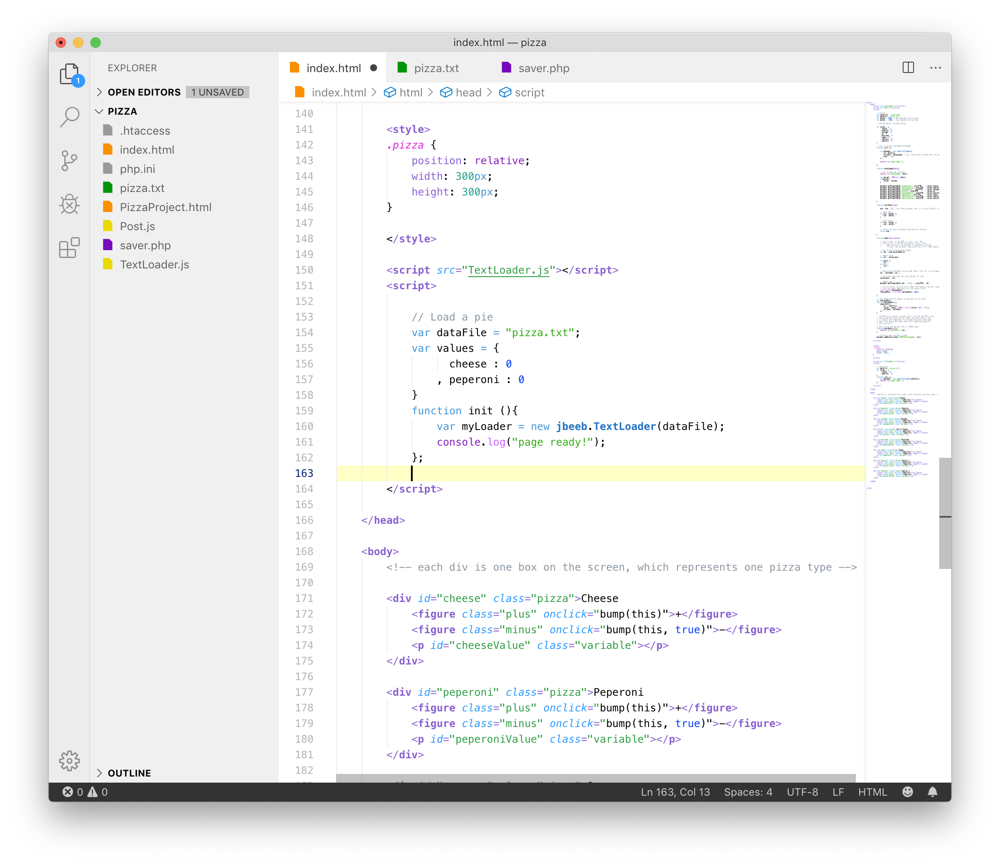
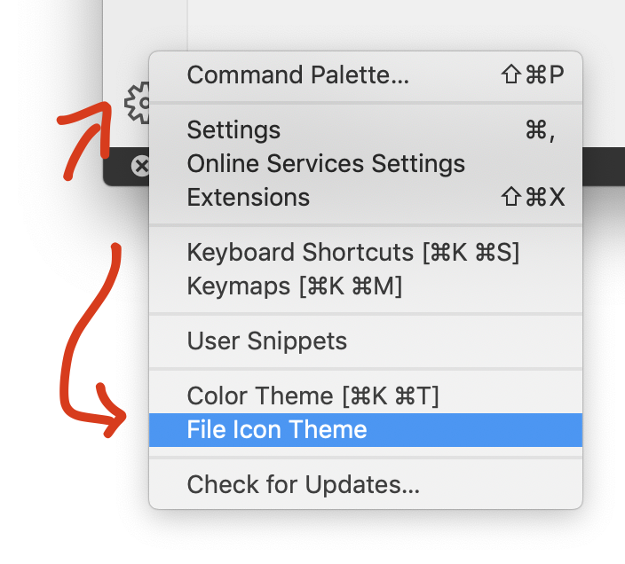
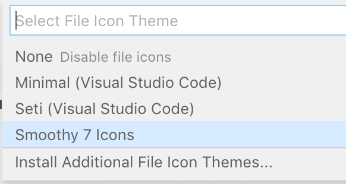

# Smoothy Theme

This is a light theme geared for web development. Also serves as a great boilerplate for developing your own custom theme.

;

Be sure to activate the built-in Smooth 7 file icon theme:

;

;

by mike gieson
www.gieson.com

# Change Log

### Version 2.0.2

- tweak search results yellow (alpha)
- matching brackets green
- windows main menu (e.g. file menu) alpha bug.

### Version 2.0.1

- added screenshots, updated README

### Version 2.0.0

- initial public release

### Version 1.0.0

- my personal scheme

